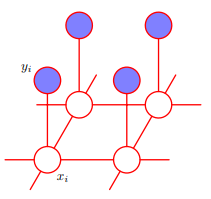
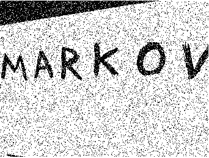
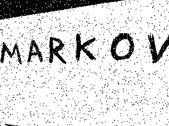

# Marco-explains-Markov
## How can Markov Random Fields help denoise a binary image?

Here's my implementation of an example from Christopher Bishop's excellent and widely read book _Pattern Recognition and Machine Learning_ (https://www.microsoft.com/en-us/research/people/cmbishop/#!prml-book). The example comes from Chapter 8.3.3 and shows how a Markov Random
Field can help denoise a binary (i.e. where the pixels are either black or white) image. Black pixels have a value of -1, white ones a value of 1. The book shows an example of what can be described and describes the method, though no code is provided, so here's my attempt to do just that.

## What's a Markov Random Field?
A Markov Random Field is an undirected graph in which the nodes correspond to variables and the links between them capture information about the variables' dependencies. The joint distribution is evaluated by taking a product of potential functions over maximal cliques (fully connected subcomponents) of the graph. I recommend reading Chapter 8 from Bishop's book for a complete treatment - here, I focus on the application.

## How will we setup the problem?
We will be dealing with an observed image, _y_ (which won't change during the course of the problem),
and our own reconstruction of it, _x_ (which will get updated at each step of the algorithm). The nodes will be the two images' pixels, and each node in _x_ will be connected to its adjacent nodes (as we expect neighbouring nodes to be somewhat correlated) as well as to the corresponding node from _y_ (as we want the reconstruction to be faithful to the original) - see the image below from Bishop's book:

.

There a two types of cliques in this graph:
- those of type {_x\_i_, _y\_i_} (between a pixel in the reconstructed image and the corresponding pixel in the observed image);
- those of type {_x\_i_, _x\_j_} (between neighbouring pixels in the reconstructed image).

We will attempt to derive an energy function such that minimising it will result in an improvement in image quality. In the book, this is done by defining the energy function to get bigger when _x\_i_ and _y\_i_ are different, and to get smaller when they are the same. It also gets bigger when _x\_i_ and its neighbour _x\_j_ are different and gets smaller when they are the same. See Chapter 8.3.3 from the book for details.

The algorithm is then as follows:
1. Choose a pixel at random.
2. Evaluate the image's total energy when this pixel is white and when this pixel is black.
3. Set this pixel to whichever state resulted in the lowest total energy for the image;

This can be repeated until convergence.

## What are the results?
Here is the noisy image I started with:

and here's the reconstructed version:


I think it does a reasonable job of cleaning up the image, especially given how simple the algorithm is!

## Running the code

1. [Download and install](https://docs.conda.io/en/latest/miniconda.html) the Conda
    distribution of Python.
2. Create a conda environment with the project's requirements:
    ```
    $ conda env create -f environment.yml 
    ```

    then
    ```
    $ conda activate marco-presents-markov
    ```
3. Type
   ```
   $ jupyter-lab
   ```
   and get started!
